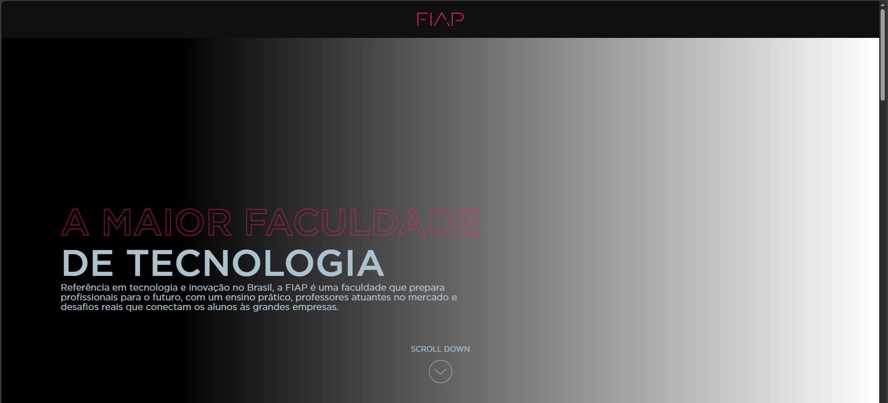
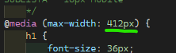
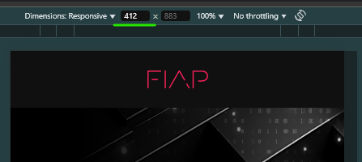

<h1 align="center">FIAP Avaliação </h1>

<p align="center">Projeto de cunho avaliatório sobre habilidades de Front end, as técnologias utilizadas foram: </p>
<!-- ÍCONES -->
<div align="center">
  
  
      
</div>
<!-- ÍCONES -->

<h2 align="center">FUNCIONAMENTO ⚙</h2>
<!-- <h3 align="center">Apenas dois pontos serão ressaltados como um pedido para o teste básico.</h3> -->

<!--<h4>1. FUNCIONAMENTO ⚙</h4>-->
### REQUISITOS:
#### Para testa-lo, utilize o **VSCode** e a extensão Liveserver
- <a href="https://code.visualstudio.com/download">VSCode</a>
- <a href="https://marketplace.visualstudio.com/items?itemName=ritwickdey.LiveServer">Liveserver</a>

**Justificativa**: Abrindo diretamente pelo *Index.html*, alguns recursos como exemplo: imagens, fonts etc. podem falhar ao carregar devido a ausência de um **Servidor Local**:
<div align="center">


</div>

<h2 align="center">RESPONSIVIDADE (412px) 📱</h2>
Seguindo o modelo proposto em Figma, as configurações de responsividade foram setadas minimamente para <b>412px</b>.

<div align="center">
<p align="center">CSS</p>

<p align="center">Liveserver</p>

</div>

<h2 align="center">Estrutura de Arquivos</h2>
   
#### Por conta do uso de apenas um arquivo CSS e SCRIPT.JS não foi necessário criar uma pasta dedicada dentro de assets.
```bash
.
├── Assets/
│   ├── fonts/
│   ├── imgs/
│   └── svg/
├── index.html
├── style.css 
├── script.js
└── README.md


